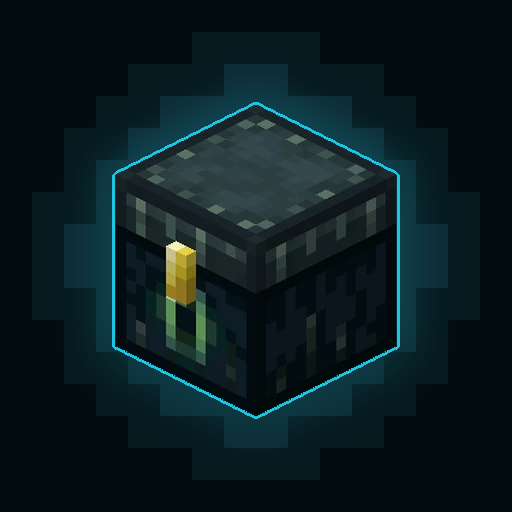
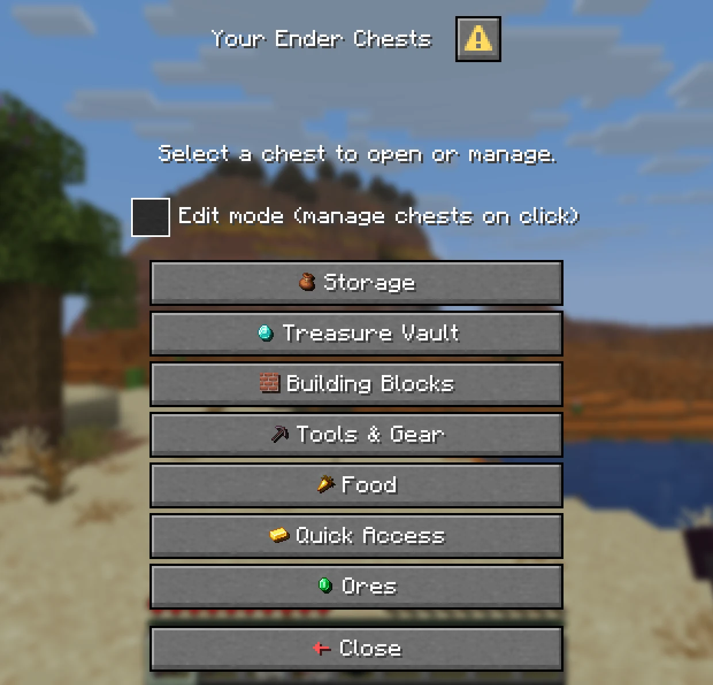
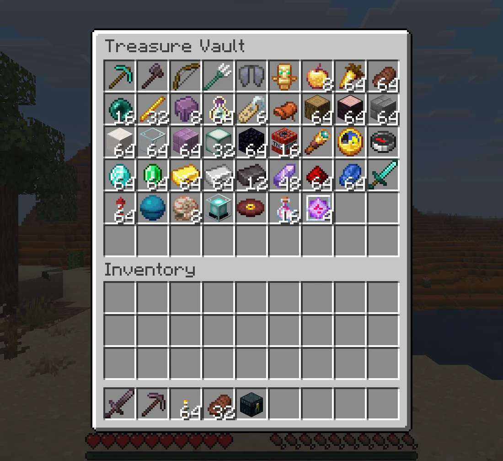

<div align="center">



# EnhancedEchest

[](https://modrinth.com/plugin/enhancedechest)
[](https://hangar.papermc.io/Nighter/EnhancedEchest)
[](https://openvdra.github.io/EnhancedEchest/)

Bigger ender chests, and several of them per player, for **Paper**, **Purpur** and **Folia**.

</div>

## Overview
* **Larger Chests:** Up to 54 slots instead of 27, sized per rank by permission.
* **Multiple Chests:** Each player owns several, with their own names and icons, managed from an in-game menu.
* **Admin Tools:** Add, resize, view and transfer any player's chests, online or offline, with temporary chests that expire.
* **Activity Log:** See who added or took what, and the chest exactly as it was after each visit.
* **Storage:** SQLite, MySQL, MariaDB or PostgreSQL, shared between servers through Redis.

Every feature is explained on the [documentation site](https://openvdra.github.io/EnhancedEchest/).

<div align="center">
<table>
  <tr>
    <td align="center"></td>
    <td align="center"></td>
  </tr>
</table>
</div>

## Requirements

| Minecraft | Server | Java |
| :--- | :--- | :---: |
| 1.21.11 – 26.2 | Paper, Purpur or Folia | 21 |

Spigot and CraftBukkit are not supported. Bedrock players joining through Geyser get the menus as Bedrock forms.

## Installation
1. Download the latest `.jar` from [Modrinth](https://modrinth.com/plugin/enhancedechest), [Hangar](https://hangar.papermc.io/Nighter/EnhancedEchest) or [Releases](https://github.com/OpenVdra/EnhancedEchest/releases).
2. Place it in the server's `plugins/` folder.
3. Restart the server. SQLite works with no setup.

## Configuration
* **Files:** `plugins/EnhancedEchest/config.yml`, plus `messages.yml` and `gui.yml` for each language under `language/`.
* **Reload:** Most settings apply with `/ee reload`. The few that need a restart are marked in the file.
* **Reference:** Every key is documented on the [configuration page](https://openvdra.github.io/EnhancedEchest/docs/configuration/).

## Commands

| Command | Description |
| :--- | :--- |
| `/ec [name\|#index]` | Open the main chest, or one chest directly |
| `/eclist` | Open the chest list |
| `/ee add\|resize\|delete` | Give, resize or delete a player's chests |
| `/ee view <player>` | View or edit a player's chest |
| `/ee log <player>` | Open a player's activity log |
| `/ee transfer`, `/ee import`, `/ee migrate` | Move chests between accounts, databases and other plugins |
| `/ee reload` | Reload config and language files |

Permissions are on the [permissions page](https://openvdra.github.io/EnhancedEchest/docs/access/permissions).

## Building
A single Gradle module on Java 21.

```bash
git clone https://github.com/OpenVdra/EnhancedEchest.git
cd EnhancedEchest
./gradlew build
```

The plugin jar lands in `build/libs/`.

| Task | Command |
| :--- | :--- |
| Dev server (Paper, with the plugin) | `./gradlew runServer` |
| Dev client that joins it | `./gradlew runClient` |
| Both at once | `./gradlew runDev` |

Contributions are welcome. English and Vietnamese are included; translation PRs are welcome too.

## Statistics
Anonymous usage statistics are sent to [FastStats](https://faststats.dev/project/enhancedechest/minecraft-plugin). Turn them off with `enabled=false` in `plugins/faststats/config.properties`.

<div align="center">
<table>
  <tr>
    <td align="center"><a href="https://faststats.dev/project/enhancedechest/minecraft-plugin"></a></td>
    <td align="center"><a href="https://faststats.dev/project/enhancedechest/minecraft-plugin"></a></td>
  </tr>
  <tr>
    <td colspan="2" align="center"><a href="https://faststats.dev/project/enhancedechest/minecraft-plugin"></a></td>
  </tr>
</table>
</div>

## License
Licensed under the [GPL-3.0](LICENSE).
